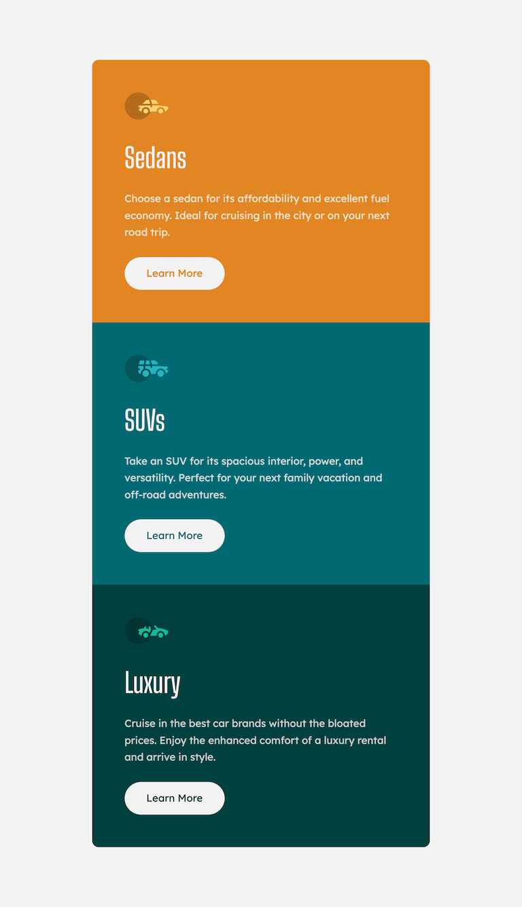
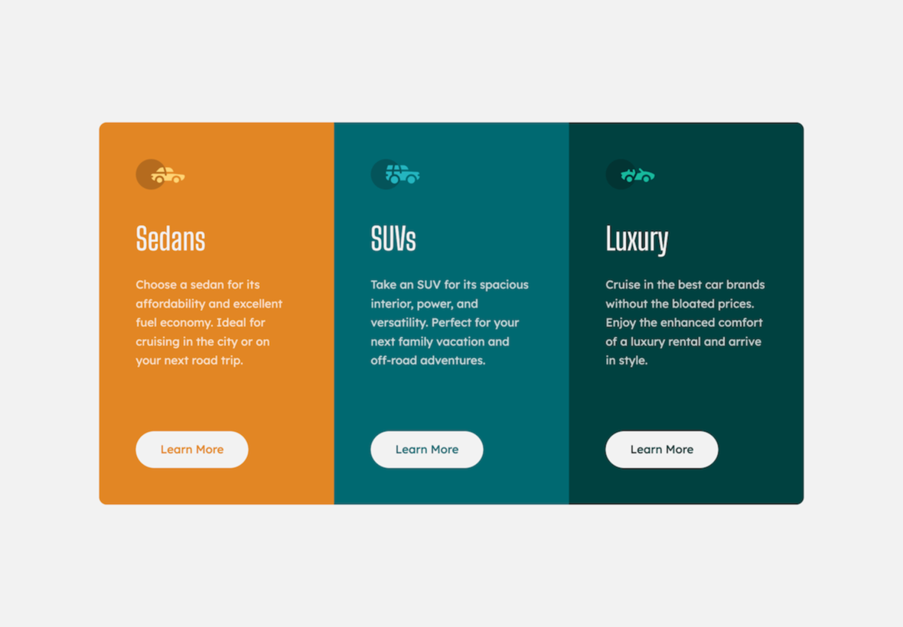
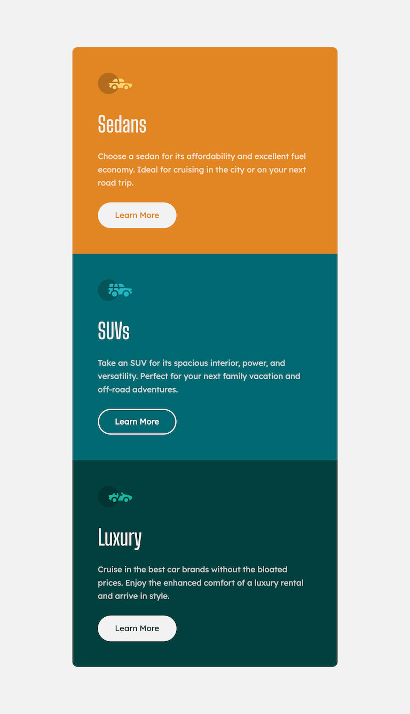
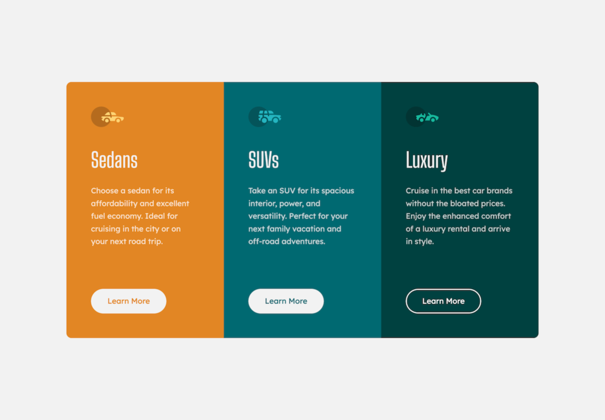

# Frontend Mentor - 3-column preview card component solution

This is a solution to the [3-column preview card component challenge on Frontend Mentor](https://www.frontendmentor.io/challenges/3column-preview-card-component-pH92eAR2-). Frontend Mentor challenges help you improve your coding skills by building realistic projects.

## Table of contents

- [Frontend Mentor - 3-column preview card component solution](#frontend-mentor---3-column-preview-card-component-solution)
  - [Table of contents](#table-of-contents)
  - [Overview](#overview)
    - [The challenge](#the-challenge)
    - [Screenshot](#screenshot)
      - [Normal states](#normal-states)
      - [Active states](#active-states)
    - [Links](#links)
  - [My process](#my-process)
    - [Built with](#built-with)
  - [Author](#author)

## Overview

### The challenge

Users should be able to:

- View the optimal layout depending on their device's screen size
- See hover states for interactive elements

### Screenshot

#### Normal states

#### Active states

### Links

- Solution URL: [https://github.com/chiaminchen/3-column-preview-card-component](https://github.com/chiaminchen/3-column-preview-card-component)
- Live Site URL: [https://chiaminchen.github.io/3-column-preview-card-component/](https://chiaminchen.github.io/3-column-preview-card-component/)

## My process

### Built with

- Semantic HTML5 markup
- CSS custom properties
- Flexbox
- Mobile-first workflow
- [React](https://reactjs.org/) - JS library
- [Vite](https://vitejs.dev/) - Frontend tooling
- [Tailwind CSS v4](https://tailwindcss.com/) - Utility-first CSS framework

## Author

- Website - [https://github.com/chiaminchen](https://github.com/chiaminchen)
- Frontend Mentor - [@chiaminchen](https://www.frontendmentor.io/profile/chiaminchen)
